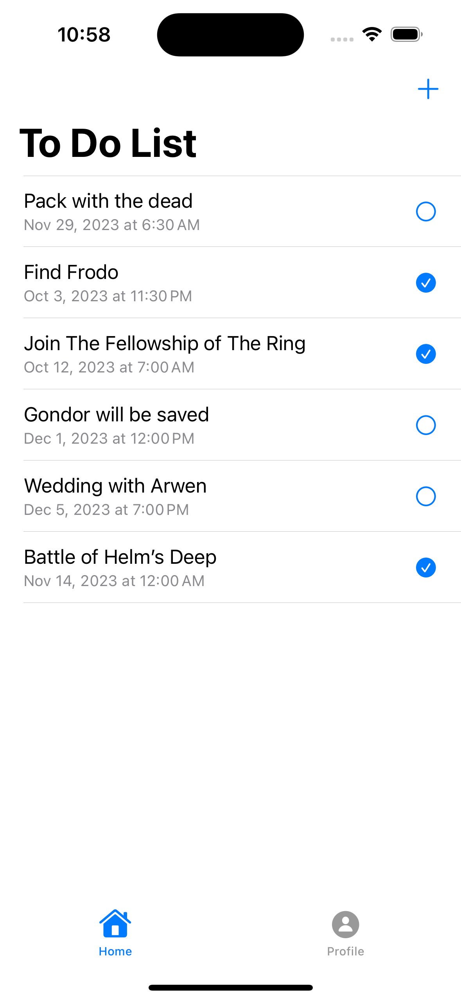
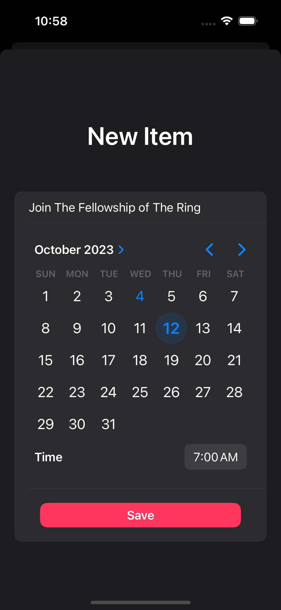

# ToDoListApp

- This application allows you to organize and keep track of your daily tasks or long-term plans by taking notes.
- While developing the application, I used some fundamental structures at a basic level. These are:
  - SwiftUI
  - Firebase
  - MVVM

# Light Mode

# Dark Mode

